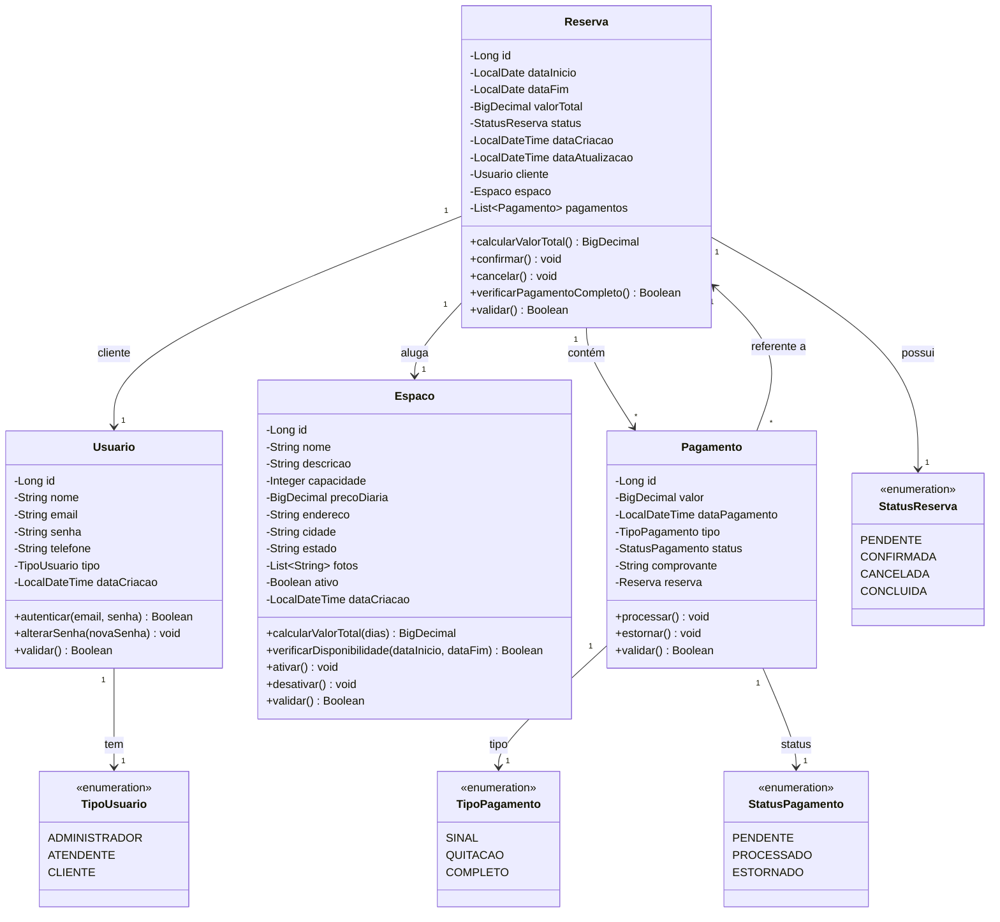
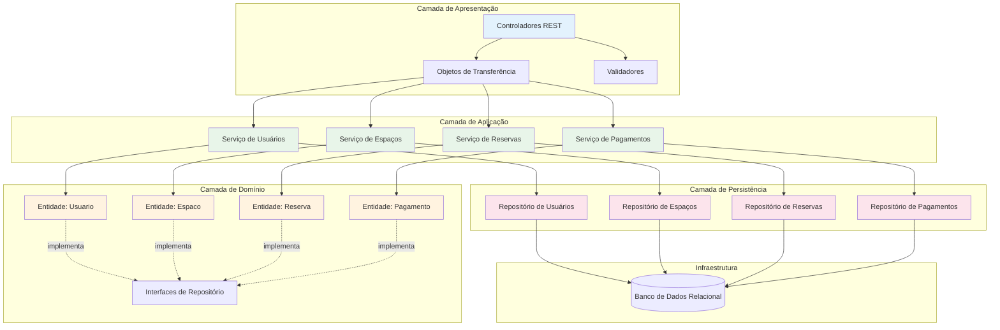

# Primeira Entrega - Sistema "Seu Cantinho"
## Trabalho Final - Design de Software

**Data:** 30 de outubro de 2025

---

## 1. Introdução

Este documento apresenta a primeira entrega do trabalho final, referente ao sistema "Seu Cantinho" para gerenciamento de reservas de espaços para festas e eventos. A entrega contempla:

- Análise comparativa de estilos arquiteturais
- Escolha e justificativa do estilo arquitetural
- Diagramas UML (Classes e Componentes)

---

## 2. Análise Comparativa de Estilos Arquiteturais

A **Tabela 1** apresenta uma análise comparativa entre as principais alternativas arquiteturais consideradas para o sistema "Seu Cantinho", avaliando critérios de qualidade relevantes ao contexto do problema.

### Tabela 1: Análise Comparativa de Estilos Arquiteturais para "Seu Cantinho"

| Critério de Qualidade | Arquitetura em Camadas (Monolítica) | Arquitetura de Microserviços |
|----------------------|-------------------------------------|------------------------------|
| **Confiabilidade (Consistência de Dados)** | **Excelente**: Transações ACID em um único banco de dados garantem a integridade de forma nativa e robusta, prevenindo o double-booking de maneira eficaz. A gestão de transações é simplificada, reduzindo pontos de falha. | **Insuficiente**: Requer complexos padrões de consistência distribuída (e.g., Sagas, 2PC), aumentando o risco de inconsistência eventual, o que é inaceitável para um sistema de reservas onde a consistência forte é mandatória. |
| **Simplicidade (Desenvolvimento e Operação)** | **Excelente**: Um único código-base e um processo de implantação unificado simplificam drasticamente o desenvolvimento, o teste e a depuração. Ideal para equipes pequenas e sistemas de complexidade moderada. Menor curva de aprendizado para novos desenvolvedores. | **Insuficiente**: A complexidade inerente à comunicação entre serviços, à implantação distribuída, ao monitoramento e à orquestração contradiz diretamente a necessidade de um sistema simples e de baixa manutenção para o contexto de negócio. |
| **Escalabilidade** | **Bom**: Pode ser escalado verticalmente (aumentando os recursos do servidor) ou horizontalmente (replicando toda a aplicação com balanceamento de carga). Para o porte atual (3 filiais) e o crescimento previsível do negócio, esta abordagem é suficiente e econômica. | **Excelente**: Oferece escalabilidade granular por serviço, permitindo escalar apenas os componentes sob maior demanda. Embora seja uma característica poderosa, representa um excesso de engenharia (over-engineering) para as necessidades atuais, introduzindo complexidade operacional desnecessária. |
| **Manutenibilidade (a Longo Prazo)** | **Bom**: Se bem estruturado em camadas com separação clara de responsabilidades, a manutenibilidade é alta. Mudanças em uma camada tendem a ser localizadas. O principal risco é a degradação arquitetural se a disciplina não for mantida ao longo do tempo. | **Bom**: A separação clara de serviços facilita a manutenção de partes isoladas do sistema. No entanto, a complexidade geral do sistema distribuído pode dificultar a compreensão do todo e a depuração de problemas que cruzam fronteiras de serviços. |
| **Disponibilidade** | **Bom**: Um ponto único de falha (a aplicação), mas pode ser mitigado com réplicas e balanceamento de carga. Tempo de recuperação geralmente rápido. Para o contexto do negócio, oferece disponibilidade adequada. | **Excelente**: Falhas isoladas em serviços individuais não comprometem todo o sistema. No entanto, a complexidade de garantir disponibilidade em um sistema distribuído é significativamente maior. |
| **Adequação ao Contexto** | **Excelente**: Alinha-se perfeitamente com o perfil do negócio (rede de 3 estados), equipe de desenvolvimento típica, e necessidade de time-to-market rápido. Permite evolução gradual da arquitetura conforme necessário. | **Insuficiente**: Inadequado para o estágio atual do negócio. Requer equipe especializada, infraestrutura sofisticada e justifica-se apenas em cenários de escala massiva ou necessidade de deploys independentes frequentes. |

### 2.1. Conclusão da Análise

Com base na análise comparativa, a **Arquitetura em Camadas** é a escolha mais adequada para o sistema "Seu Cantinho" pelos seguintes motivos:

1. **Confiabilidade crítica**: A garantia de consistência transacional é essencial para prevenir double-booking
2. **Simplicidade operacional**: Alinha-se com a necessidade de baixa complexidade operacional
3. **Adequação ao porte**: O volume atual não justifica a complexidade de microserviços
4. **Custo-benefício**: Menor overhead operacional e de desenvolvimento
5. **Evolução gradual**: Permite migração futura se necessário, sem comprometer a entrega inicial

---

## 3. Estilo Arquitetural Escolhido: Arquitetura em Camadas

### 3.1. Estrutura Proposta

A arquitetura em camadas organiza o sistema em quatro camadas principais, cada uma com responsabilidades bem definidas:

```
┌─────────────────────────────────────────┐
│      CAMADA DE APRESENTAÇÃO             │
│   - Interface com o usuário             │
│   - Controladores de API REST           │
│   - Validação de entrada                │
│   - Serialização/Deserialização         │
└─────────────────────────────────────────┘
              ↓ ↑
┌─────────────────────────────────────────┐
│      CAMADA DE APLICAÇÃO                │
│   - Lógica de negócio                   │
│   - Orquestração de operações           │
│   - Gerenciamento de transações         │
│   - Aplicação de regras de negócio      │
└─────────────────────────────────────────┘
              ↓ ↑
┌─────────────────────────────────────────┐
│      CAMADA DE DOMÍNIO                  │
│   - Entidades de negócio                │
│   - Objetos de valor                    │
│   - Regras de domínio encapsuladas      │
│   - Interfaces de contratos             │
└─────────────────────────────────────────┘
              ↓ ↑
┌─────────────────────────────────────────┐
│      CAMADA DE PERSISTÊNCIA             │
│   - Acesso a dados                      │
│   - Mapeamento objeto-relacional        │
│   - Consultas e comandos ao BD          │
└─────────────────────────────────────────┘
              ↓ ↑
┌─────────────────────────────────────────┐
│         BANCO DE DADOS                  │
└─────────────────────────────────────────┘
```

### 3.2. Princípios da Arquitetura

- **Separação de responsabilidades**: Cada camada tem uma função específica e bem delimitada
- **Dependência unidirecional**: Camadas superiores dependem de camadas inferiores
- **Coesão alta, acoplamento baixo**: Minimização de dependências entre camadas
- **Substituibilidade**: Camadas podem ser substituídas sem impactar as demais (ex: trocar banco de dados)

---

---

## 4. Modelagem UML

### 4.1. Diagrama de Classes

O diagrama de classes representa as principais entidades do domínio e seus relacionamentos:



### 4.2. Diagrama de Componentes

O diagrama de componentes ilustra a organização do sistema em camadas e a relação entre os componentes principais:



### 4.3. Descrição dos Componentes

#### **Camada de Apresentação**
- **Controladores REST**: Exposição das funcionalidades via API
- **Objetos de Transferência (DTOs)**: Estruturas para comunicação entre camadas
- **Validadores**: Validação de dados de entrada

#### **Camada de Aplicação**
- **Serviços**: Orquestração da lógica de negócio para cada entidade
  - Serviço de Usuários: Gerenciamento de autenticação e autorização
  - Serviço de Espaços: CRUD e consultas de disponibilidade
  - Serviço de Reservas: Criação, confirmação e prevenção de conflitos
  - Serviço de Pagamentos: Controle de transações financeiras

#### **Camada de Domínio**
- **Entidades**: Objetos de negócio com regras encapsuladas
- **Interfaces de Repositório**: Contratos para acesso a dados

#### **Camada de Persistência**
- **Repositórios**: Implementação concreta do acesso a dados
- Abstração do mecanismo de persistência

---

## 5. Conclusão
