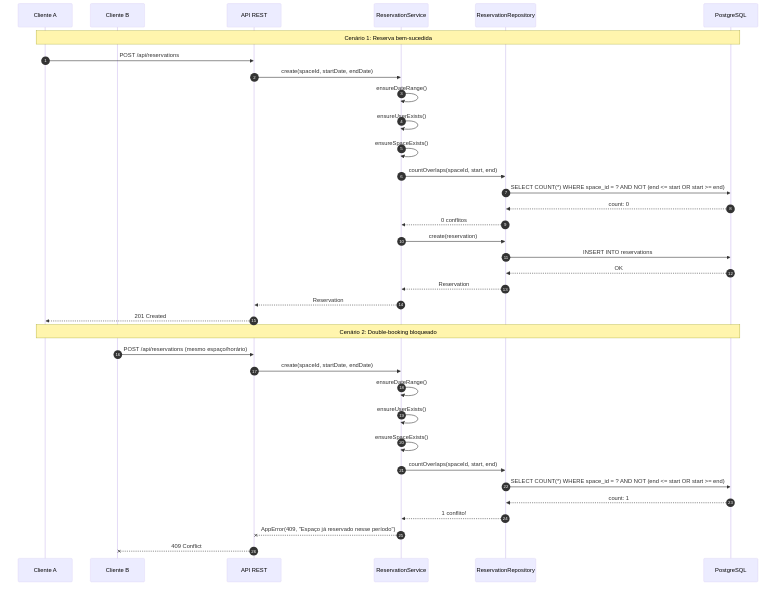
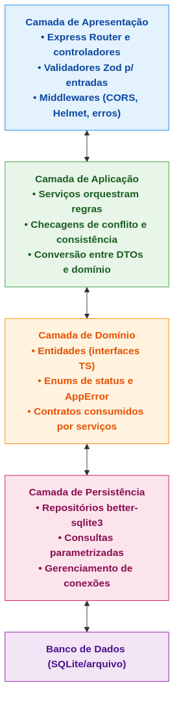
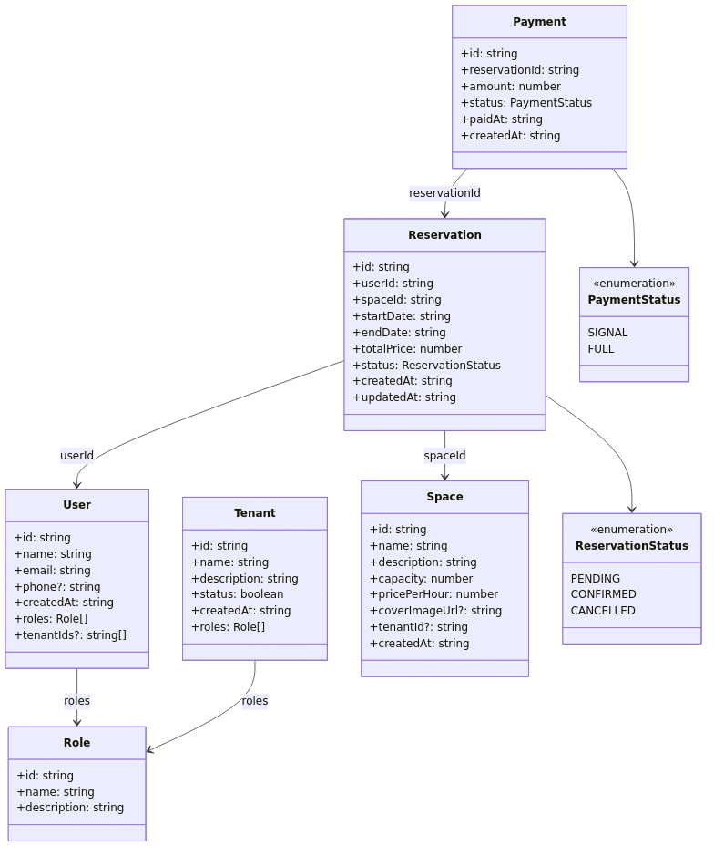
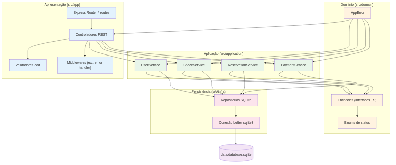

## 1. Introdução

Este documento apresenta a documentação final do sistema "Seu Cantinho", uma plataforma para gerenciamento de reservas de espaços para festas e eventos. O documento contempla a análise arquitetural, diagramas UML, decisões de design e detalhamento da implementação.

### 1.1 ASR's (Requisitos Arquiteturalmente Significativos)

- **Consistência de Dados** (Alto): Evitar double-booking com transações confiáveis
- **Confiabilidade** (Alto): Robustez contra falhas e recuperação rápida
- **Usabilidade** (Médio): Interface simples considerando baixa familiaridade tecnológica
- **Escalabilidade** (Alto): Suporte para crescimento e múltiplas filiais
- **Manutenibilidade** (Alto): Facilidade para evolução e novas funcionalidades

### 1.2 Restrições Técnicas

- **REST**: API com documentação OpenAPI/Swagger
- **Docker**: Execução via `docker compose up`

---

## 2. Análise de Estilos Arquiteturais

| Estilo | Adequação ao "Seu Cantinho" |
| :--- | :--- |
| **Monolítico** | Adequado para estágio inicial pela simplicidade e transações ACID nativas, mas pode limitar crescimento futuro para múltiplas filiais. |
| **Microserviços** | Inadequado: alta complexidade operacional injustificada para o porte do negócio, dificuldade em garantir consistência forte (double-booking) e requer expertise avançada. |
| **Camadas** | **Escolha ideal**: equilibra simplicidade operacional, manutenibilidade, consistência transacional e permite evolução gradual conforme crescimento do negócio. |

### 2.1. Justificativa da Escolha: Arquitetura em Camadas

1. **Consistência crítica**: Transações ACID para prevenir double-booking
2. **Simplicidade**: Baixa complexidade operacional adequada ao contexto
3. **Custo-benefício**: Menor overhead de desenvolvimento e operação
4. **Evolução gradual**: Permite migração futura sem comprometer entrega inicial

---

## 3. Suporte a Múltiplas Filiais (Multi-Tenancy)

O sistema foi projetado para suportar a expansão do "Seu Cantinho" para múltiplas filiais através do modelo **Tenant**:

### 3.1 Modelo de Dados

```typescript
interface Tenant {
  id: string;
  name: string;           // Ex: "Seu Cantinho - Curitiba Centro"
  description?: string;
  status: boolean;        // Ativo/Inativo
  createdAt: string;
  roles?: Role[];         // Papéis específicos do tenant
}

interface Space {
  // ...
  tenantId?: string;      // Vincula espaço a uma filial
}

interface User {
  // ...
  tenantIds?: string[];   // Usuário pode atuar em múltiplas filiais
}
```

### 3.2 Funcionamento

1. **Isolamento por Filial**: Cada espaço (`Space`) pertence a um `Tenant` específico através do campo `tenantId`
2. **Gestão Centralizada**: Usuários administrativos podem ter acesso a múltiplos tenants via `tenantIds[]`
3. **Escalabilidade**: Novas filiais são criadas como novos registros de `Tenant`, sem alterações no código
4. **Consultas Filtradas**: A listagem de espaços pode ser filtrada por `tenantId` para exibir apenas os espaços de uma filial específica

### 3.3 Exemplo de Uso

```
Tenant: "Seu Cantinho - Curitiba"
  └── Espaços: Salão Principal, Chácara Verde, Quadra Coberta

Tenant: "Seu Cantinho - São Paulo"  
  └── Espaços: Salão Executivo, Espaço Jardim
```

---

## 4. Perfis de Usuário e Controle de Acesso

O sistema implementa um modelo de papéis (roles) para diferenciar tipos de usuários:

### 4.1 Modelo de Papéis

```typescript
interface Role {
  id: string;
  name: string;           // Ex: "master", "admin", "employee", "client"
  description?: string;
}

interface User {
  id: string;
  name: string;
  email: string;
  roles: Role[];          // Usuário pode ter múltiplos papéis
  tenantIds?: string[];   // Filiais que o usuário pode acessar
}
```

### 4.2 Tipos de Usuários Previstos

| Perfil | Descrição | Permissões |
|--------|-----------|------------|
| **master** | Dona Maria / Proprietária | Acesso total a todas as filiais, relatórios financeiros, gestão de usuários |
| **admin** | Gerente de Filial | Gestão de espaços e reservas da sua filial |
| **employee** | Atendente | Criar/editar reservas, registrar pagamentos |
| **client** | Cliente Final | Visualizar espaços, solicitar reservas |

### 4.3 Fluxo de Reserva por Tipo de Usuário

**Clientes podem fazer reservas?** Sim, com o seguinte fluxo:

1. **Cliente acessa o catálogo** → Visualiza espaços disponíveis com fotos, capacidade e preço
2. **Cliente solicita reserva** → Reserva é criada com status `PENDING`
3. **Funcionário/Admin confirma** → Após verificação, status muda para `CONFIRMED`
4. **Pagamento é registrado** → Sinal (`SIGNAL`) ou quitação (`FULL`)

Este fluxo garante que:

- Clientes têm autonomia para iniciar reservas
- A equipe do "Seu Cantinho" mantém controle sobre confirmações
- Dona Maria pode revisar reservas pendentes quando necessário

---

## 5. Prevenção de Double-Booking: Implementação Detalhada

### 5.1 O Problema

Double-booking ocorre quando o mesmo espaço é reservado por diferentes clientes para o mesmo período, causando conflitos e insatisfação.

### 5.2 A Solução Implementada

A prevenção é garantida na **Camada de Aplicação** (`ReservationService`) através de validação síncrona antes de cada criação/atualização de reserva:

```typescript
// src/application/services/ReservationService.ts

public async create(input: CreateReservationInput): Promise<Reservation> {
  // 1. Valida intervalo de datas
  this.ensureDateRange(input.startDate, input.endDate);
  
  // 2. Verifica se usuário existe
  await this.ensureUserExists(input.userId);
  
  // 3. Verifica se espaço existe
  await this.ensureSpaceExists(input.spaceId);
  
  // 4. VERIFICAÇÃO CRÍTICA: Checa conflitos de horário
  await this.ensureAvailability(input.spaceId, input.startDate, input.endDate);
  
  // 5. Só então cria a reserva
  return await this.repository.create({ ...input, status });
}

private async ensureAvailability(spaceId, start, end, excludeId?) {
  const conflicts = await this.repository.countOverlaps(spaceId, start, end, excludeId);
  if (conflicts > 0) {
    throw new AppError('Espaço já reservado nesse período.', 409); // HTTP 409 Conflict
  }
}
```

### 5.3 Consulta SQL de Detecção de Conflitos

O repositório executa a seguinte consulta para detectar sobreposições:

```sql
SELECT COUNT(*) as count FROM reservations
WHERE space_id = $1                           -- Mesmo espaço
  AND status != 'CANCELLED'                   -- Ignora reservas canceladas
  AND NOT (end_date <= $2 OR start_date >= $3) -- Detecta sobreposição temporal
```

**Lógica de sobreposição**: Duas reservas NÃO conflitam apenas se uma termina antes da outra começar. Qualquer outra situação configura conflito.

### 5.4 Diagrama de Sequência - Prevenção de Double-Booking



O diagrama ilustra dois cenários:

1. **Cenário 1 (sucesso)**: Cliente A cria reserva, sistema verifica disponibilidade, encontra 0 conflitos e persiste a reserva
2. **Cenário 2 (bloqueio)**: Cliente B tenta reservar mesmo espaço/horário, sistema detecta 1 conflito e retorna HTTP 409

### 5.5 Garantias Adicionais

1. **Validação em Updates**: Ao editar uma reserva, o sistema exclui a própria reserva da verificação (`excludeId`) para permitir ajustes de horário
2. **Status Considerados**: Apenas reservas `PENDING` e `CONFIRMED` bloqueiam novas reservas; `CANCELLED` são ignoradas
3. **Atomicidade**: A verificação e criação ocorrem na mesma requisição, minimizando race conditions
4. **Resposta Clara**: Retorna HTTP 409 com mensagem "Espaço já reservado nesse período" para feedback imediato

---

## 6. Arquitetura em Camadas



**Princípios**: Separação de responsabilidades, dependência unidirecional (superior → inferior), alta coesão e baixo acoplamento, substituibilidade de camadas.

### 6.1 Mapeamento Camadas → Código

| Camada | Diretório | Responsabilidade |
|--------|-----------|------------------|
| **Apresentação** | `src/app/` | Controllers REST, validação de entrada (Zod), middlewares |
| **Aplicação** | `src/application/` | Regras de negócio, orquestração, validações de domínio |
| **Domínio** | `src/domain/` | Entidades, enums, erros padronizados |
| **Infraestrutura** | `src/infra/` | Repositórios PostgreSQL, conexão com banco |

### 6.2 Fluxo de uma Requisição

```
HTTP Request
     ↓
[Apresentação] Controller recebe, valida entrada com Zod
     ↓
[Aplicação] Service aplica regras de negócio (ex: ensureAvailability)
     ↓
[Domínio] Entidades e enums definem estrutura dos dados
     ↓
[Infraestrutura] Repository persiste no PostgreSQL
     ↓
HTTP Response
```

---

## 7. Diagramas UML

### 7.1. Diagrama de Classes



Entidades principais: **User**, **Space**, **Reservation** e **Payment**, alinhadas diretamente com as interfaces utilizadas na API. As reservas referenciam `userId` e `spaceId`, os pagamentos se ligam a uma reserva via `reservationId`, e os estados possíveis são representados por `ReservationStatus` (`PENDING`, `CONFIRMED`, `CANCELLED`) e `PaymentStatus` (`SIGNAL`, `FULL`).

**Entidades de suporte**: **Tenant** (filiais) e **Role** (papéis) permitem multi-tenancy e controle de acesso.

### 7.2. Diagrama de Componentes



Organização em 4 camadas: **Apresentação** (Express Router, controladores e validadores Zod), **Aplicação** (serviços por agregado), **Domínio** (interfaces, enums e erros) e **Persistência** (repositórios que gravam em um banco PostgreSQL montado por volume Docker).

---

## 8. Trade-offs e Decisões de Design

| Decisão | Alternativa Descartada | Justificativa |
|---------|------------------------|---------------|
| Arquitetura em Camadas | Microserviços | Simplicidade operacional; double-booking requer consistência forte |
| PostgreSQL | MongoDB | Transações ACID nativas; integridade referencial |
| Validação síncrona | Fila assíncrona | Feedback imediato ao usuário; menor complexidade |
| Multi-tenant por coluna | Banco separado por tenant | Menor custo operacional; adequado para porte atual |
| Roles no usuário | Sistema de ACL completo | Suficiente para os perfis identificados; mais simples |

---

## 9. Instruções de Execução

### 9.1 Pré-requisitos

- Docker 28.4+
- Docker Compose

### 9.2 Execução

```bash
# Clone o repositório
git clone https://github.com/Ribapax/desSoft2502.git
cd desSoft2502

# Inicie todos os serviços
docker compose up --build

# Acesse:
# - API: http://localhost:3333/api
# - Documentação Swagger: http://localhost:3333/docs
# - Frontend: http://localhost:8080
```

### 9.3 Credenciais de Acesso (Demo)

O sistema já vem com dados de demonstração. Para acessar o frontend:

| Campo | Valor |
|-------|-------|
| **URL** | <http://localhost:8080/login> |
| **Email** | `maria@seucantinho.com` |
| **Senha** | `senha123` |

Este usuário possui perfil **master** (Dona Maria) com acesso total ao sistema.

### 9.4 Verificação Rápida

```bash
# Health check
curl http://localhost:3333/api/health
# Resposta esperada: {"status":"ok"}

# Listar espaços
curl http://localhost:3333/api/spaces
```

---

## 10. Reflexões Finais

O sistema "Seu Cantinho" foi desenvolvido priorizando:

1. **Robustez contra double-booking**: A validação na camada de aplicação garante que conflitos sejam detectados antes da persistência
2. **Preparação para crescimento**: O modelo de Tenants permite adicionar novas filiais sem alterações estruturais
3. **Flexibilidade de perfis**: O sistema de roles suporta desde a Dona Maria (master) até clientes finais
4. **Simplicidade operacional**: Arquitetura em camadas com deployment via Docker Compose em comando único

A escolha por manter a verificação de disponibilidade síncrona (ao invés de locks pessimistas ou filas) foi deliberada considerando o volume esperado de operações do "Seu Cantinho" - uma rede de espaços para festas não possui o throughput de um sistema de venda de ingressos, tornando a abordagem atual suficiente e mais simples de manter.
